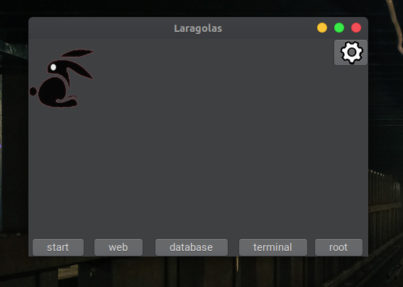

# LARAGOLAS

GUI do laravel para Linux.


## Requisitos
*   Ter uma Debian based distro
*   Systemd

## Dependências
*   libgtk-3-dev
*   mysql
*   mysql-workbench
*   make
*   gcc
*   composer
*   php
*   apache2

## Instalação

```bash
   git clone https://github.com/MarusDod/Laragolas
   cd Laragolas
   chmod +x configure.sh
   ./configure.sh
   make release
   sudo make install
```

## Desinstalação

```bash
   sudo make uninstall
```

## Correr
```bash
   $ sudo laragolas
```

 | 